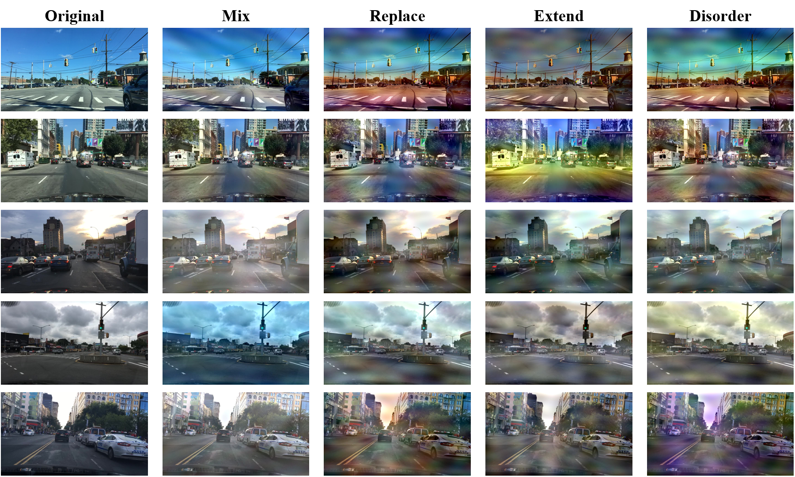
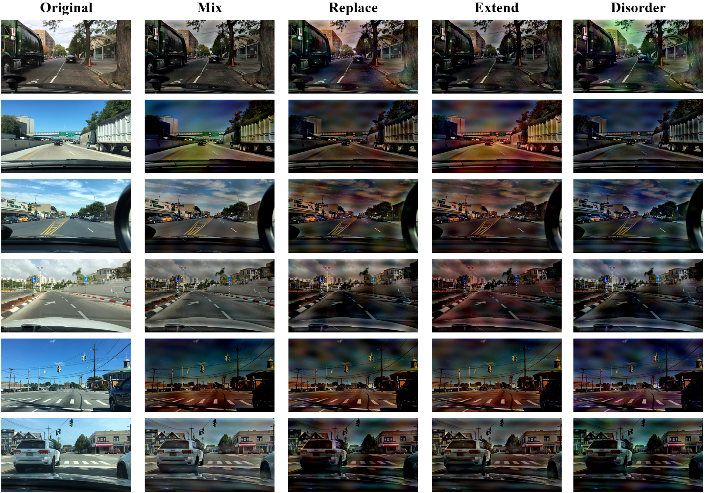
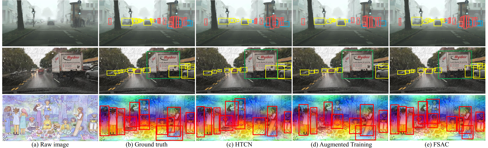

# Frequency Spectrum Augmentation Consistency for Domain Adaptive Object Detection

## Main requirements
torch >= 1.0
torchvision >= 0.2.0
Python 3

## Environmental settings
This repository is developed using python 3.6.12 on Ubuntu 16.04.5 LTS. The CUDA and pytorch version is 11.2 and 1.7.1. We use one NVIDIA 3090 GPU card for training and testing.

## Dataset
PASCAL VOC, Watercolor, Cityscapes, Foggycityscapes -> Please follow the instructions in [[Link](https://github.com/VisionLearningGroup/DA_Detection)] to prepare the datasets.

Daytime-Sunny, Dusk-Rainy, and Night-Rainy -> Dataset preparation instruction link [[Link](https://github.com/AmingWu/VDD-DAOD)].

## Code
Faster R-CNN -> Thanks for jwyang [[Link](https://github.com/jwyang/faster-rcnn.pytorch/tree/pytorch-1.0)]; Fourier Domain Adaptation -> Thanks for Yanchao Yang [[Link](https://github.com/YanchaoYang/FDA)].

Our Augmentation (Mix+Replace+Extend+Disorder).

## Train
To train a faster R-CNN model with vgg16 on pascal_voc:
```
CUDA_VISIBLE_DEVICES=$GPU_ID python trainval_net.py --dataset pascal_voc --net vgg16 --bs 1 --cuda
```

And you need to add augmentated data in the loadpath by creating a new dataset_name variable.

## Test
To test:
```
python test_net.py --dataset pascal_voc --net vgg16 --modelpath your modelpath --cuda
```

## Augmentation
Daytime-Sunny -> Dusk-Rainy


Daytime-Sunny -> Night-Rainy


## Result

